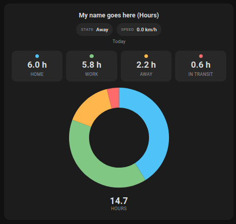

# Time Spent Pie Card

[](https://github.com/hacs/integration)
[](https://github.com/miplatas/time-spent-pie-card/releases)
[](https://github.com/miplatas/time-spent-pie-card/commits/main)

A custom Home Assistant Lovelace card that shows a **pie or doughnut chart** with accumulated time in hours for each location and the `In transit` state, based on `person.*` entity history.



---

## Features

- Queries the Home Assistant history API for a **daily** range (today, 00:00 -> now) or **weekly** range (Monday 00:00 -> now).
- **Speed hysteresis filter**: use `speed_set_threshold` to enter In transit and `speed_reset_threshold` to leave In transit.
- Speed estimation from GPS history includes anti-jitter filtering (minimum sample interval, minimum distance jump, and plausible speed cap).
- In transit classification also requires sustained movement above threshold (time or distance), not only a single speed spike.
- Automatically classifies `Home`, `In transit`, `Unknown`, and any custom HA zones.
- Shows live header pills for the person's **current state** and **current speed**.
- Supports both **doughnut** and **pie** chart styles via configuration.
- Adapts to light/dark themes using native HA CSS variables.
- Responsive layout: use it in grids or columns to show one family member per card.

---

## Installation With HACS

1. Go to **HACS -> Frontend -> ... -> Custom repositories**.
2. Add this repository URL and select the **Lovelace** category.
3. Install the card and reload the UI.

### Manual Installation

Copy `time-spent-pie-card.js` to `<config>/www/` and add the resource in **Settings -> Dashboards -> Resources**:

```yaml
url: /local/time-spent-pie-card.js
type: module
```

---

## YAML Configuration

```yaml
type: custom:time-spent-pie-card
entity: person.person1          # Required - person.* entity
name: Person 1                  # Optional - custom title
time_range: daily               # Required - "daily" or "weekly"
chart_type: doughnut            # Optional - "doughnut" or "pie" (default: doughnut)
speed_set_threshold: 15         # Optional - km/h to enter "In transit" (default: 15)
speed_reset_threshold: 10       # Optional - km/h to exit "In transit" (default: speed_set_threshold)
debug: false                    # Optional - show debug details on the card
```

### Parameters

| Field                   | Type    | Required | Default                  | Description |
|-------------------------|---------|----------|--------------------------|-------------|
| `entity`                | string  | Yes      | -                        | `person.*` entity to monitor |
| `name`                  | string  | No       | Entity `friendly_name`   | Card title |
| `time_range`            | string  | Yes      | -                        | `daily` (today 00:00->now) or `weekly` (Monday 00:00->now) |
| `chart_type`            | string  | No       | `doughnut`               | Chart style: `doughnut` or `pie` |
| `speed_set_threshold`   | number  | No       | `15`                     | Speed (km/h) at or above which In transit starts |
| `speed_reset_threshold` | number  | No       | `speed_set_threshold`    | Speed (km/h) at or below which In transit ends |
| `debug`                 | boolean | No       | `false`                  | Shows debug details (source, tracker counts, sample points) |
| `speed_threshold`       | number  | No       | Legacy fallback          | Backward-compatible fallback used when `speed_set_threshold` is not provided |

### Parameter Details

- `entity`:
  Selects the Home Assistant `person.*` entity used to query history and classify time by location/state.
- `name`:
  Optional title shown at the top of the card. If omitted, the entity `friendly_name` is used.
- `time_range`:
  Defines the aggregation window.
  - `daily`: from today at 00:00 to now.
  - `weekly`: from Monday at 00:00 to now.
- `chart_type`:
  Visual style of the chart.
  - `doughnut`: ring chart.
  - `pie`: full pie chart.
- `speed_set_threshold`:
  Speed in km/h that turns the state to `In transit`.
- `speed_reset_threshold`:
  Speed in km/h that exits `In transit`. Must be less than or equal to `speed_set_threshold`.
  Typical values: `15` set and `10` reset.

Derived-motion safeguards used internally:
- Minimum interval between GPS samples: `15 s`
- Minimum movement between samples: `15 m`
- Maximum plausible speed cap: `220 km/h`
- Sustained movement requirement to classify `In transit`: at least `60 s` above set threshold or about `300 m` of above-threshold movement
- `debug`:
  Shows an additional debug box with source tracker id, tracker counts, and sample tracker points.
- `speed_threshold` (legacy):
  Backward-compatible fallback only. When `speed_set_threshold` is not set, this value is used as the set threshold.

---

## Example - Multiple People In A Grid

```yaml
type: grid
columns: 3
square: false
cards:
  - type: custom:time-spent-pie-card
    entity: person.person1
    name: Person 1
    time_range: weekly
    chart_type: doughnut
    speed_set_threshold: 18
    speed_reset_threshold: 10

  - type: custom:time-spent-pie-card
    entity: person.person2
    name: Person 2
    time_range: weekly
    chart_type: pie
    speed_set_threshold: 20
    speed_reset_threshold: 12
```

## More Configuration Examples

### Minimal Daily Card

```yaml
type: custom:time-spent-pie-card
entity: person.person1
time_range: daily
```

### Weekly Pie Style With Custom Thresholds

```yaml
type: custom:time-spent-pie-card
entity: person.person1
name: Person 1 Weekly
time_range: weekly
chart_type: pie
speed_set_threshold: 22
speed_reset_threshold: 14
```

### Two-Column Dashboard For Two People

```yaml
type: grid
columns: 2
square: false
cards:
  - type: custom:time-spent-pie-card
    entity: person.person1
    name: Person 1
    time_range: daily
    chart_type: doughnut

  - type: custom:time-spent-pie-card
    entity: person.person2
    name: Person 2
    time_range: daily
    chart_type: doughnut
```

### Debug Example (Troubleshooting)

```yaml
type: custom:time-spent-pie-card
entity: person.person2
name: Person 2 Debug
time_range: daily
chart_type: doughnut
speed_set_threshold: 15
speed_reset_threshold: 10
debug: true
```

### Example From This Configuration

```yaml
type: custom:time-spent-pie-card
entity: person.person1
name: My name goes here
time_range: daily
speed_set_threshold: 20
speed_reset_threshold: 5
chart_type: doughnut
```

### Legacy Compatibility Example

```yaml
type: custom:time-spent-pie-card
entity: person.person1
time_range: daily
speed_threshold: 15
```

### Recommended Hysteresis Values

```yaml
type: custom:time-spent-pie-card
entity: person.person1
time_range: daily
speed_set_threshold: 15
speed_reset_threshold: 10
```

---

## Repository Structure

```
.
|-- time-spent-pie-card.js   # Main card code
|-- hacs.json                # HACS manifest
`-- README.md
```

---

## Technical Notes

- The card **does not require** additional sensors or helpers; it builds accumulators in real time directly from history.
- Internally it uses **Chart.js 4**, loaded dynamically from CDN if it is not available on the page.
- History refresh is limited to **once per minute** to avoid overloading the API.
- States with accumulated `0 h` are omitted from both the chart and stats chips.
- Total accumulated hours are displayed below the chart.

---

## Changelog

- `1.0.0`: Initial release.
- `1.0.1`: Fixed speed error bug.
- `1.0.2`: Fixed speed error bug.
- `1.0.3`: Added hysteresis thresholds (set/reset) for speed detection.
- `1.0.4`: Improved speed derivation with anti-jitter GPS filters.
- `1.0.5`: Added sustained-movement requirement to reduce false In transit detection.
- `1.0.6`: Fixed persistent false In transit positives. Each interval is now evaluated independently using median speed + minimum distance (200 m) requirement. Removed shared hysteresis state that caused entire days to be classified as In transit after a single GPS spike. Added MAX_DT_SECONDS guard on GPS pairs to suppress stale-ping errors.
- `1.0.7`: Fixed speed under-reporting (~3.6x too low) for native GPS device trackers (HA Companion App, OwnTracks, etc.). Their `speed`/`velocity`/`gps_speed` attributes are reported in m/s by the underlying Android/iOS location APIs but were being treated as km/h when no unit attribute was present. Now correctly assumed to be m/s for those attributes.
- `1.0.8`: Fixed the live "State" pill showing "Away"/"Home" instead of "In transit" while driving for trackers (e.g. Life360) that don't expose a speed attribute. The live pill now falls back to a position-derived speed estimate from the most recently cached GPS history (median speed + 200 m moving-distance check, ignored if the last sample is older than 3 minutes).
- `1.0.9`: Fixed donut history classification so long `not_home` intervals are split into actual `In transit` time plus remaining `Away` time, avoiding all-day false `In transit` blocks near threshold boundaries (e.g. 32 vs 33 km/h). Also fixed the visual editor output to always include `type: custom:time-spent-pie-card`.
- `1.0.10`: Updated default speed set and reset thresholds to 20 and 5 km/h.
- `1.0.11`: Added a debug historical state-vs-time graph at the bottom (debug mode), fixed to the selected time_range (daily/weekly), to calibrate Away vs In transit classification. Includes colored state bands for easier threshold tuning. **Current release.**
---

## License

GNU - Copyright (c) miplatas / FIME-UANL
